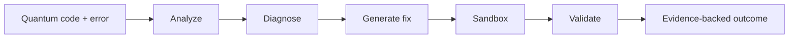

# QResolve — Quantum Runtime Error Solver

<details>
<summary><strong>⚡ Quick navigation</strong></summary>

**Explore:** [What it is](#what-it-is) · [Architecture](#architecture) · [Capabilities](#current-capabilities) · [Engineering evidence](#engineering-evidence) · [Security](#security-boundary) · [Run locally](#development)

</details>

QResolve is a quantum-computing debugging system focused on a specific problem:

> **Diagnose the failure, propose a correction, execute the corrected program, and report the verification evidence.**

Rather than treating an LLM explanation as proof, QResolve separates diagnosis and fix generation from actual runtime validation.

## Workflow

```
Quantum code + error
        ↓
Framework detection
        ↓
Error / code analysis
        ↓
Root-cause diagnosis
        ↓
Candidate fix
        ↓
Sandboxed execution
        ↓
Validation
        ↓
Evidence-backed result
```

## Supported quantum ecosystems

The current runtime dependencies include:

- **Qiskit**
- **Cirq Core**
- **PennyLane**

The architecture is organized around runtime adapters so additional quantum frameworks can be introduced without rewriting the diagnostic pipeline.

## Core components

```
backend/
├── analyzer/
├── diagnostics/
├── fix_engine/
├── knowledge/
├── reasoning/
├── runtimes/
├── sandbox/
├── validation/
├── providers/
└── api/
```

### Runtime abstraction

Framework-specific execution is separated behind runtime adapters.

Conceptually:

```
Quantum Runtime
    ├── Qiskit
    ├── Cirq
    └── PennyLane
```

This allows the solver to distinguish quantum-specific runtime behavior from generic application errors.

### Verification states

QResolve does not reduce every result to “fixed” or “failed”.

It can report states such as:

- **VERIFIED** — the corrected program executed successfully and the original failure was resolved.
- **PARTIALLY_VERIFIED** — the runtime failure was addressed, but additional behavioral validation is still required.
- **FAILED_VERIFICATION** — the proposed correction still fails validation.
- **UNVERIFIED** — there is insufficient execution evidence to claim a verified fix.

Ambiguous cases are kept unresolved rather than forcing a speculative correction.

## Sandboxed execution

QResolve executes user-provided quantum programs in a restricted runtime boundary.

The execution layer applies controls including:

- isolated interpreter startup
- controlled environment variables
- temporary working directories
- output limits
- execution timeouts
- cleanup after execution
- Windows process/resource controls where supported

The sandbox is deliberately explicit about what it does and does not isolate. In particular, the current design does **not** claim unrestricted filesystem and network isolation.

## Example

A circuit references a qubit that does not exist.

Instead of returning only:

```
"Your qubit index is invalid."
```

the intended workflow is:

```
1. Locate the failing operation
2. Determine the circuit's actual qubit range
3. Generate a candidate correction
4. Execute the corrected circuit
5. Verify the original runtime error is gone
6. Report the evidence
```

## Desktop application

QResolve includes a desktop launcher and packaged Windows application path alongside the backend and frontend components.

The launcher uses an explicit port policy and refuses to silently move to a different port when a collision is detected.

## Testing philosophy

Tests cover the diagnostic and execution boundaries rather than only UI behavior.

The project includes coverage for:

- quantum runtime failures
- ambiguous cases
- verification-state handling
- timeout behavior
- memory/output constraints
- cleanup
- packaged application behavior
- runtime adapters

The important metric is not the number of explanations generated.

It is whether a proposed correction can produce **runtime evidence**.

## Security model

Quantum code is still user-provided code.

QResolve therefore treats execution as a security-sensitive operation and documents sandbox limitations rather than claiming stronger isolation than the platform actually provides.

Do not run untrusted code with permissions beyond the intended sandbox boundary.

## Development

Install dependencies:

```bat
python -m venv .venv
.venv\\Scripts\\pip install -r requirements.txt
```

Run the backend:

```bat
python run.py
```

Run tests:

```bat
python -m pytest
```

## Project status

QResolve is a focused quantum debugging and runtime-validation project. The current implementation is intentionally narrower than a general-purpose quantum IDE: it concentrates on **diagnosis → correction → execution → verification**.

---

**Built with:** Python · FastAPI · Qiskit · Cirq · PennyLane · pytest


<details>
<summary><strong>👀 Reading this repository</strong></summary>

If you have only one minute, read the opening principle, then inspect the architecture and verification/testing sections. The project is intentionally documented around **what the system can demonstrate**, not what it is intended to become.

</details>

<details>
<summary><strong>🧪 Interactive debugging map</strong></summary>



The solver's central rule is **do not call a fix verified until the runtime provides evidence**.

</details>
